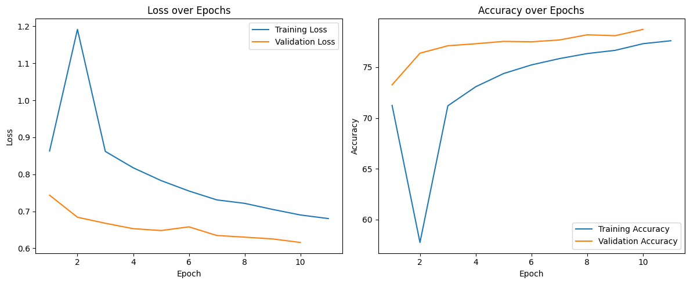
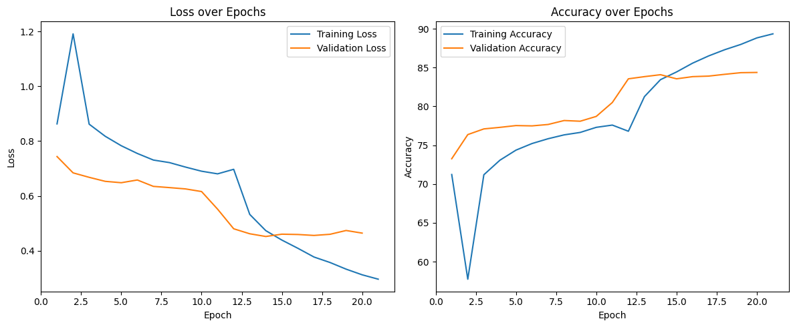

# Classification with Transfer Learning

## Overview
This project involves training a classification model for the CIFAR-10 dataset using transfer learning. Pre-trained models such as VGG16, MobileNet, and MobileNetV3-Large are utilized to compare performance, training times, and accuracy. The CIFAR-10 dataset consists of 60,000 images across 10 classes.

## Objective
- Utilize transfer learning to classify images in the CIFAR-10 dataset.
- Compare the performance of different pre-trained models.
- Optimize training through fine-tuning and model architecture modifications.

## Dataset
- **Dataset:** CIFAR-10
- **Classes:** ('plane', 'car', 'bird', 'cat', 'deer', 'dog', 'frog', 'horse', 'ship', 'truck')
- **Data Split:**
  - Training: 80%
  - Validation: 20%
  - Testing: Separate test set

## Preprocessing
To handle the difference in image dimensions between ImageNet (224x224) and CIFAR-10 (32x32):
- Images are resized to 224x224.
- Normalized using ImageNet mean and standard deviation values.

## Models Used
### 1. VGG16
- **Architecture Motivation:** Simplicity and small filter sizes that align with CIFAR-10.
- **Approach:**
  - Freeze all convolutional layers.
  - Replace the classifier with custom layers.

#### Results
- **Validation Loss:** 0.9409
- **Validation Accuracy:** 67.60%
- **Training Time:** TOO LONG

#### Comments:
- The model struggled to converge and required significant computational time.

### 2. MobileNetV2
- **Architecture Motivation:** Small size, faster training, and efficiency.
- **Approach:**
  - Freeze all convolutional layers.
  - Replace the classifier with custom layers.

#### Results
- **Validation Loss:** 0.6159
- **Test Accuracy:** 78.71%
- **Training Time:** 1064.39 seconds



#### Comments:
- Performed better than VGG16, but there was still room for improvement.

### 3. MobileNetV3-Large
- **Architecture Motivation:** Advanced optimization and state-of-the-art efficiency.
- **Approach:**
  - Freeze all convolutional layers.
  - Replace only one layer in the classifier.

#### Results
- **Validation Loss:** 0.4642
- **Test Accuracy:** 84.37%
- **Training Time:** 1019.37 seconds



#### Comments:
- This was the best-performing model in terms of test accuracy and training time.

## Conclusion
- **Best Model:** MobileNetV3-Large achieved the highest test accuracy (84.37%) and was efficient in training.
- **Future Work:**
  - Experiment with fine-tuning convolutional layers for MobileNetV3-Large.
  - Explore additional architectures like EfficientNet.
  - Analyze additional performance metrics.

## Repository Structure
```plaintext
.
├── data/                 # Dataset folder
├── plots/                # Loss and accuracy plots
├── data.py           # Data loading and preprocessing
├── models.py         # Model architecture definitions
├── visualization.py      # Visualization functions
├── train_utils.py      # train and evaluation functions
├── main_train.py           # Main script to train and save models
├── inference.py      # Script for inference using trained models
├── requirements.txt      # Required Python packages
├── README.md             # Project report and details
```

## Requirements
Install dependencies using:
```bash
pip install -r requirements.txt
```

## Usage
### Training
Run the main script to train all models:
```bash
python main_train.py
```

### Inference
Perform inference using trained models:
```bash
python inference.py
```

## Acknowledgments
- Pre-trained models and architectures: PyTorch torchvision library.
- Dataset: CIFAR-10.

