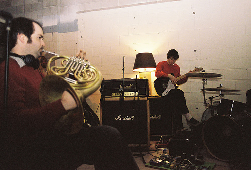
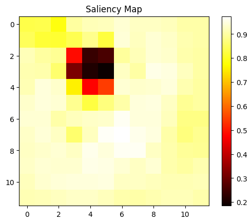

# Classification with Transfer Learning

## Overview
This project involves training a classification model for the CIFAR-10 dataset using transfer learning. Pre-trained models such as VGG16, MobileNet, and MobileNetV3-Large are utilized to compare performance, training times, and accuracy. The CIFAR-10 dataset consists of 60,000 images across 10 classes.

## Objective
- Utilize transfer learning to classify images in the CIFAR-10 dataset.
- Compare the performance of different pre-trained models.
- Optimize training through fine-tuning and model architecture modifications.

## Dataset
- **Dataset:** CIFAR-10
- **Classes:** ('plane', 'car', 'bird', 'cat', 'deer', 'dog', 'frog', 'horse', 'ship', 'truck')
- **Data Split:**
  - Training: 80%
  - Validation: 20%
  - Testing: Separate test set

## Preprocessing
To handle the difference in image dimensions between ImageNet (224x224) and CIFAR-10 (32x32):
- Images are resized to 224x224.
- Normalized using ImageNet mean and standard deviation values.

## Models Used
### 1. VGG16
- **Architecture Motivation:** Simplicity and small filter sizes that align with CIFAR-10.
- **Approach:**
  - Freeze all convolutional layers.
  - Replace the classifier with custom layers.

#### Results
- **Validation Loss:** 0.9409
- **Validation Accuracy:** 67.60%
- **Training Time:** TOO LONG

#### Comments:
- The model struggled to converge and required significant computational time.

### 2. MobileNetV2
- **Architecture Motivation:** Small size, faster training, and efficiency.
- **Approach:**
  - Freeze all convolutional layers.
  - Replace the classifier with custom layers.

#### Results
- **Validation Loss:** 0.6159
- **Test Accuracy:** 78.71%
- **Training Time:** 1064.39 seconds


#### Comments:
- Performed better than VGG16, but there was still room for improvement.

### 3. MobileNetV3-Large
- **Architecture Motivation:** Advanced optimization and state-of-the-art efficiency.
- **Approach:**
  - Freeze all convolutional layers.
  - Replace only one layer in the classifier.

#### Results
- **Validation Loss:** 0.4642
- **Test Accuracy:** 84.37%
- **Training Time:** 1019.37 seconds


#### Comments:
- This was the best-performing model in terms of test accuracy and training time.

## Conclusion
- **Best Model:** MobileNetV3-Large achieved the highest test accuracy (84.37%) and was efficient in training.
- **Future Work:**
  - Experiment with fine-tuning convolutional layers for MobileNetV3-Large.
  - Explore additional architectures like EfficientNet.
  - Analyze additional performance metrics.

## Repository Structure
```plaintext
.
├── data/                 # Dataset folder
├── plots/                # Loss and accuracy plots
├── data.py           # Data loading and preprocessing
├── models.py         # Model architecture definitions
├── visualization.py      # Visualization functions
├── train_utils.py      # train and evaluation functions
├── main_train.py           # Main script to train and save models
├── inference.py      # Script for inference using trained models
├── requirements.txt      # Required Python packages
├── README.md             # Project report and details
```

## Requirements
Install dependencies using:
```bash
pip install -r requirements.txt
```

## Usage
### Training
Run the main script to train all models:
```bash
python main_train.py
```

### Inference
Perform inference using trained models:
```bash
python inference.py
```

# Saliency Map Generation using MobileNetV2

This experiment demonstrates the generation of **saliency maps** for a pretrained **MobileNetV2** model using masked image techniques. The goal is to identify regions in an image that the model relies on for its classification predictions. Saliency maps provide a visual understanding of how convolutional neural networks (CNNs) focus on different parts of an image.

---

## 1. **Experiment Overview**
The experiment aims to:
- Highlight the most critical regions in an image that influence a model's prediction.
- Understand how convolutional layers focus on specific regions.
- Demonstrate the impact of masking on classification probabilities.

---

## 2. **Procedure**

### a. **Model and Preprocessing**
- **Model**: A pretrained **MobileNetV2** model from PyTorch's torchvision library is used.
- **Preprocessing**:
  - Input images are resized to 224x224.
  - Images are normalized using ImageNet's standard mean and standard deviation.
  - Converted into tensors for inference.

### b. **Mask Application**
- A black square mask of size `30x30` pixels is applied to the image.
- The mask slides across the entire image in both horizontal and vertical directions, moving with a stride of 20 pixels.
- Each mask position generates a new masked version of the image.

### c. **Saliency Mapping**
- Each masked image is passed through the model.
- The output probabilities for the correct class are recorded for every mask position.
- The recorded probabilities are reshaped into a 2D saliency map (heatmap) representing the importance of each region to the model's prediction.

### d. **Visualization**
- The saliency map is visualized as a heatmap overlaid on the original image.
- The saliency map highlights the areas where the mask caused the highest drop in classification probability, indicating the regions critical for the model's predictions.

---

## 3. **Results**

### a. **Input Image**
The experiment uses a sample image of a French horn and musicians as input. Below is the original input image:



### b. **Saliency Map**
The generated saliency map clearly highlights the object's region (e.g., the French horn) as critical for classification. It is visualized below:



---

## 4. **Observations**
- **Focus**: The saliency map effectively highlights the most critical areas, such as the French horn, demonstrating the model's focus during classification.
- **Impact of Masking**: When the mask overlaps significant regions of the image, the model's prediction probabilities for the correct class drop significantly.
- **Visualization**: Saliency maps provide an intuitive understanding of how the model perceives and prioritizes different regions of the image.

---

## 5. **Conclusion**
The experiment showcases the importance of saliency maps in explaining the behavior of deep learning models. It also demonstrates how masking techniques can help identify critical regions in images for model predictions.

---

### Acknowledgments
- **Pretrained Model**: MobileNetV2 from PyTorch's torchvision library.
- **Dataset**: Sample image demonstrating saliency mapping.
